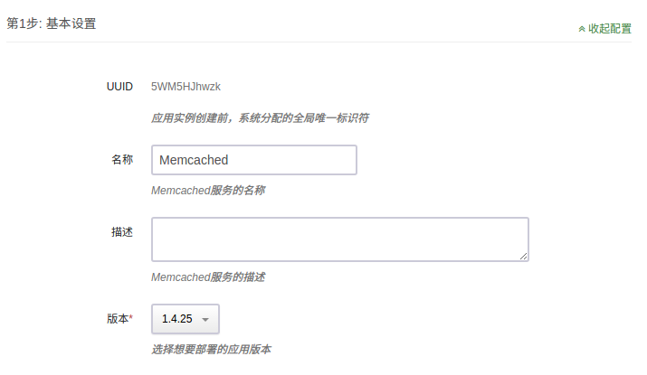
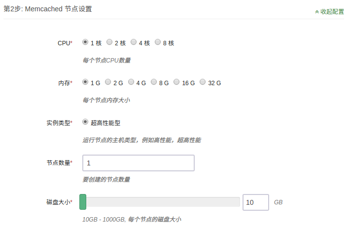
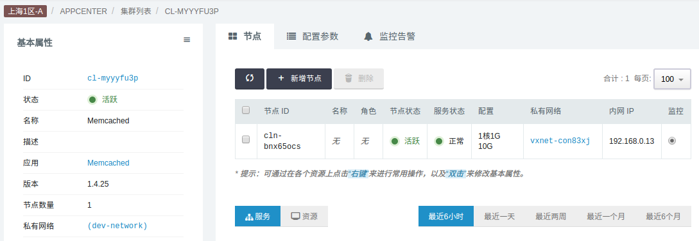
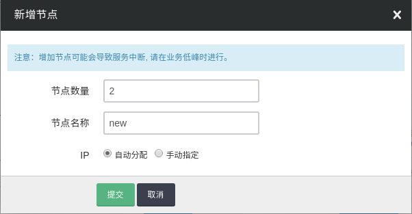
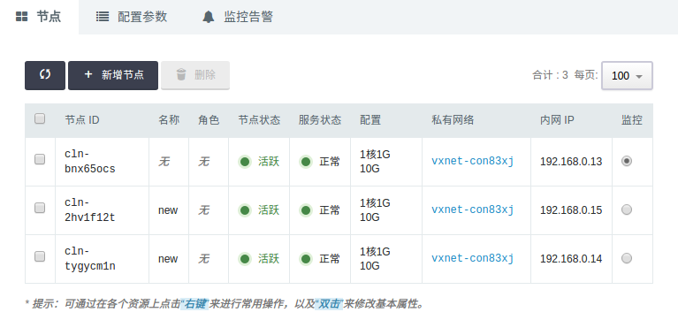
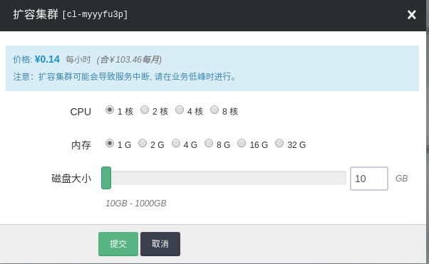
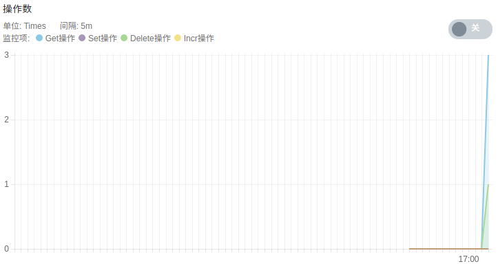

# Memcached on QingCloud AppCenter
Memcached 是一个开源、分布式的内存缓存系统。

Memcached on QingCloud 将 Memcached 制作成App,　能直接在AppCenter 进行一键部署。

## 创建Memcached App

### 准备

在部署 App 之前，您需要创建一个 VPC 网络S和关联一个 Vxnet 私有网络，详情见 ([VPC 指南](https://docs.qingcloud.com/guide/vpc.html))

### 1) 基本配置

填写基本信息，包括名称和描述。

### 2) Memcached 节点设置

配置Memcached节点，包括CPU, 内存等信息。

### 3) 网络设置

选择服务部署的私有网络，可以选择之前创建的任意网络。

### 4) Memcached服务环境参数配置

### 创建成功

当Memcached服务创建完成之后，我们可以查看Memcached节点的运行状态。 

## 测试
当缓存服务创建完成之后，我们可以进行连接测试。 如图所示，我们可以同时连接到多节点进行查询和写入，Memcached 的客户端会根据 Hash 算法来自动计算数据的存放节点位置。

## 在线伸缩

在缓存服务运行过程中，会出现服务能力不足或者容量不够的情况，您都可以通过扩容来解决。

### 1）增加Memcached缓存节点

Memcached 缓存服务支持多个缓存节点。当容量或者性能不足时，您可以通过增加缓存节点来提升。 

`默认的 Memcached 客户端使用简单 Hash 来进行数据分片，当增加或删除节点时可能会造成大量的缓存失效。可以采用支持一致性 Hash 算法的 Memcached 客户端来避免这个问题，例如 [hash_ring](https://pypi.python.org/pypi/hash_ring)`

下图为扩容之后的节点列表。

### 2）增加Memcached缓存容量

当缓存容量不足时，您可以通过扩容操作来提升缓存容量。

## 监控
我们提供了强大的监控和告警功能，帮助用户更好的管理和维护运行中的 Memcached 缓存集群。

## FAQ

* VNC 登陆账户和密码是多少？
  用户账号 ubuntu，密码 p12cHANgepwD，拥有 sudo 能力。
